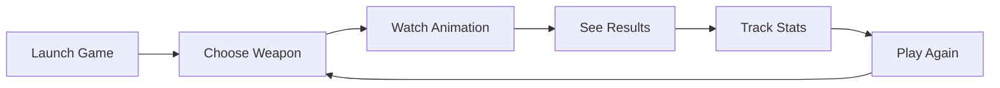

# Rock-Paper-Scissors Game

<div align="center">


**A modern, GUI-based Rock-Paper-Scissors game built with Python and Tkinter**  
*Featuring beautiful dark mode UI/UX design, loading animations, score tracking, and persistent statistics*

[](https://github.com/ShubhieSingh/CodSoft_4)
[](https://python.org)
[](https://docs.python.org/3/library/tkinter.html)
[](https://github.com/ShubhieSingh/CodSoft_4)
[](LICENSE)

[Quick Start](#quick-start) • [Features](#features) • [How to Play](#how-to-play) • [Project Structure](#project-structure) • [Contributing](#contributing)

---

### **Star this repository if you found it helpful!** ⭐

</div>

## Features

<details>
<summary><strong>Core Gameplay</strong></summary>

- **Interactive GUI**: Modern, user-friendly interface with hover effects and smooth interactions
- **Loading Animation**: Exciting loading sequence with countdown when making choices
- **Smart AI Opponent**: Computer makes random choices for fair gameplay
- **Game Logic**: Implements classic Rock-Paper-Scissors rules
  - **Rock** beats **Scissors**
  - **Scissors** beats **Paper**
  - **Paper** beats **Rock**

</details>

<details>
<summary><strong>Advanced Features</strong></summary>

- **Score Tracking**: Persistent statistics across game sessions
- **Win Rate Calculation**: Automatic calculation of success percentage
- **Game History**: Tracks wins, losses, ties, and total games played
- **Data Persistence**: Statistics saved to JSON file automatically
- **Reset Functionality**: Easy statistics reset with confirmation

</details>

<details>
<summary><strong>Modern Dark Mode UI/UX</strong></summary>

- **Beautiful Dark Theme**: Elegant dark color scheme designed for comfortable viewing
- **Animated Interactions**: Exciting loading animations and visual feedback
- **Visual Feedback**: Emoji representations and intuitive result displays
- **Responsive Layout**: Well-organized sections for easy navigation
- **Interactive Elements**: Hover effects and visual state changes
- **User-Friendly**: Clear instructions and feedback messages
- **Eye-Comfortable**: Reduced eye strain with carefully chosen dark colors

</details>

## Quick Start

### Prerequisites
-  or higher
-  (usually included with Python installations)

### Installation

```bash
# Clone the repository
git clone https://github.com/ShubhieSingh/CodSoft_4.git

# Navigate to project directory
cd CodSoft_4

# No additional dependencies needed! 
# The game uses only Python standard library modules.
```

### Run the Game

<details>
<summary><strong>Windows</strong></summary>

```powershell
# Method 1: Direct Python execution (Recommended)
python main.py

# Method 2: Using specific Python version
python3 main.py

# Method 3: Double-click main.py in File Explorer
```

</details>

<details>
<summary><strong>Linux / macOS</strong></summary>

```bash
# Method 1: Direct execution
python3 main.py

# Method 2: Make executable and run
chmod +x main.py
./main.py
```

</details>

## How to Play

<div align="center">



</div>

| Step | Action | Description |
|------|--------|-------------|
| **1** | **Launch** | Run `main.py` to open the game window |
| **2** | **Choose** | Click one of the three weapons:<br/>**Rock** - Crushes scissors<br/>**Paper** - Covers rock<br/>**Scissors** - Cuts paper |
| **3** | **Watch** | Enjoy the exciting loading sequence as the computer thinks! |
| **4** | **Results** | See your choice vs computer's choice and the outcome |
| **5** | **Track** | Monitor your statistics in real-time |
| **6** | **Repeat** | Keep playing rounds to improve your win rate! |

## Project Structure

```
CodSoft_4/
├── main.py                    # Main game application
├── README.md                  # Project documentation  
├── requirements.txt           # Python dependencies (minimal)
├── game_stats.json           # Generated: Persistent game statistics
└── LICENSE                   # MIT License
```

### Key Files

| File | Purpose | Description |
|------|---------|-------------|
| `main.py` | **Main Application** | Complete game implementation with GUI |
| `game_stats.json` | **Statistics** | Auto-generated player statistics |
| `README.md` | **Documentation** | This comprehensive guide |
| `requirements.txt` | **Dependencies** | Python package requirements |

## Technical Details

<details>
<summary><strong>Architecture</strong></summary>

- **Object-Oriented Design**: Clean, modular code structure
- **Enum Classes**: Type-safe choice and result handling  
- **Dataclasses**: Efficient statistics management
- **Error Handling**: Robust file operations and user input validation

</details>

<details>
<summary><strong>Key Components</strong></summary>

### `Choice` Enum
```python
class Choice(Enum):
    ROCK = "rock"
    PAPER = "paper" 
    SCISSORS = "scissors"
```

### `GameStats` Dataclass
```python
@dataclass
class GameStats:
    wins: int = 0
    losses: int = 0
    ties: int = 0
    total_games: int = 0
```

### `RockPaperScissorsGame` Class
- **GUI Management**: Handles all Tkinter interface elements
- **Game Logic**: Implements rules and winner determination
- **Statistics**: Manages score tracking and persistence
- **User Experience**: Provides feedback and visual elements

</details>

<details>
<summary><strong>Color Scheme (Dark Mode)</strong></summary>

| Element | Color Code | Usage |
|---------|------------|-------|
| **Background** | `#0f172a` | Deep dark blue for main background |
| **Surface** | `#1e293b` | Darker slate for containers |
| **Card** | `#334155` | Medium slate for elevated elements |
| **Primary** | `#3b82f6` | Bright blue for action buttons |
| **Secondary** | `#6366f1` | Indigo for highlights and hover states |
| **Text** | `#f1f5f9` | Light slate for primary text |
| **Text Secondary** | `#94a3b8` | Medium slate for secondary text |
| **Success** | `#10b981` | Emerald for positive feedback |
| **Danger** | `#ef4444` | Red for warnings and exit actions |
| **Warning** | `#f59e0b` | Amber for reset and caution actions |

</details>

## Statistics Features

- **Real-time Updates**: Statistics update immediately after each round
- **Win Rate Calculation**: Automatic percentage calculation
- **Persistent Storage**: Stats saved to `game_stats.json`
- **Reset Functionality**: Option to clear all statistics with confirmation
- **Session Continuity**: Resume where you left off

## UI/UX Design Principles

<details>
<summary><strong>Modern Dark Interface</strong></summary>

- **Dark Theme Design**: Sophisticated dark color scheme for modern appeal
- **Typography**: Segoe UI font with high contrast for readability
- **Spacing**: Generous padding and margins for comfortable viewing
- **Color Psychology**: Strategic use of colors for user guidance in dark environments

</details>

<details>
<summary><strong>User Experience</strong></summary>

- **Immediate Feedback**: Instant visual response to user actions
- **Clear Navigation**: Intuitive button placement and labeling
- **Visual Hierarchy**: Important information prominently displayed with proper contrast
- **Accessibility**: High contrast ratios and readable fonts optimized for dark mode
- **Eye Comfort**: Reduced blue light exposure for extended gaming sessions

</details>

## Future Enhancements

<div align="center">

**Planned Features for Next Releases**

</div>

| Feature | Status | Description |
|---------|--------|-------------|
| **Multiplayer Mode** | *Planned* | Play against friends over network |
| **Tournament Mode** | *Planned* | Best-of-X rounds with bracket system |
| **Custom Themes** | *Planned* | Multiple UI themes and color schemes |
| **Sound Effects** | *Planned* | Audio feedback for actions and results |
| **Animations** | *Implemented* | Smooth transitions and choice reveals |
| **Advanced AI** | *Planned* | Pattern recognition and strategy adaptation |
| **Leaderboards** | *Planned* | Global or local high score tracking |
| **Localization** | *Planned* | Multiple language support |

## Development

<details>
<summary><strong>Code Style</strong></summary>

- **PEP 8 Compliant**: Follows Python style guidelines
- **Type Hints**: Uses modern Python typing for better code clarity
- **Documentation**: Comprehensive docstrings and comments
- **Modular Design**: Easily extensible and maintainable

</details>

<details>
<summary><strong>Testing</strong></summary>

To test the game functionality:
1. Run multiple rounds and verify score accuracy
2. Test statistics persistence by closing and reopening
3. Verify all UI elements respond correctly
4. Test edge cases like rapid clicking
5. Confirm loading animations work smoothly

</details>

## 🤝 Contributing

<div align="center">

**We welcome contributions from developers of all skill levels!**

[](https://github.com/ShubhieSingh/CodSoft_4/pulls)

</div>

### 🚀 How to Contribute

1. **🍴 Fork** the repository
2. **🌿 Create** a feature branch (`git checkout -b feature/amazing-feature`)
3. **💻 Commit** your changes (`git commit -m 'Add amazing feature'`)
4. **📤 Push** to the branch (`git push origin feature/amazing-feature`)
5. **📬 Open** a Pull Request

### � Contribution Guidelines

- Follow PEP 8 Python style guidelines
- Add type hints to new functions
- Include docstrings for new methods
- Test your changes thoroughly
- Update documentation if needed

### 🐛 Found a Bug?

Please [open an issue](https://github.com/ShubhieSingh/CodSoft_4/issues) with:
- Clear description of the problem
- Steps to reproduce
- Expected vs actual behavior
- Your system information

## Acknowledgments

<div align="center">

| Technology | Thanks For |
|------------|------------|
| **Python Community** | Excellent standard library |
| **Tkinter** | Built-in GUI framework |
| **Modern UI Design** | Contemporary web design principles |
| **Game Theory** | Classic Rock-Paper-Scissors rules |

</div>

## License

<div align="center">

This project is licensed under the **MIT License** - see the [LICENSE](LICENSE) file for details.

[](LICENSE)

</div>

## Support & Contact

<div align="center">

**Need help or have suggestions?**

[](https://github.com/ShubhieSingh/CodSoft_4/issues)
[](https://github.com/ShubhieSingh/CodSoft_4/discussions)

1. Check [existing issues](https://github.com/ShubhieSingh/CodSoft_4/issues)
2. Create a [new issue](https://github.com/ShubhieSingh/CodSoft_4/issues/new) with detailed description
3. Join [discussions](https://github.com/ShubhieSingh/CodSoft_4/discussions) for questions
4. Include system information and error messages

---

<div align="center">

**Enjoy playing Rock-Paper-Scissors!**

*Made with ❤️ and Python*

**Don't forget to star this repo if you found it helpful!** ⭐

</div>
